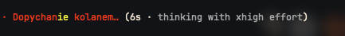
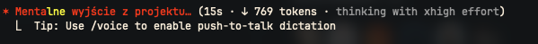
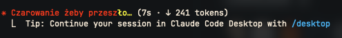

# claude-nsfw-pl

Wulgarne, polskie czasowniki spinnera dla [Claude Code](https://claude.com/claude-code).
Zamiast grzecznego *"Conjuring..."* zobaczysz *"Ogarnianie burdelu"*, *"Klepanie tego gówna"*
albo *"Mentalne wyjście z projektu"*.

> UWAGA: te teksty są celowo wulgarne i NSFW.







## Co to robi

Podmienia domyślne czasowniki spinnera Claude Code na własną listę przez klucz
`spinnerVerbs` w `settings.json`:

```json
{
  "spinnerVerbs": {
    "mode": "replace",
    "verbs": [
      "Ogarnianie burdelu",
      "Klepanie tego gówna",
      "..."
    ]
  }
}
```

`"mode": "replace"` całkowicie zastępuje wbudowane czasowniki listą z tego repo.

## Wymagania

- [`jq`](https://jqlang.github.io/jq/) (`brew install jq` / `apt install jq`)
- Claude Code w wersji wspierającej `spinnerVerbs`

## Instalacja

Sklonuj repo, i uruchom skrypt.

```bash
git clone https://github.com/ldziedziul/claude-nsfw-pl.git
cd claude-nsfw-pl
./install.sh
```

Skrypt robi backup istniejącego `settings.json` do `settings.json.bak` i scala czasowniki zachowując resztę ustawień.

Po instalacji zrestartuj Claude Code.

## Cofnięcie zmian

```bash
mv "${CLAUDE_CONFIG_DIR:-$HOME/.claude}/settings.json.bak" "${CLAUDE_CONFIG_DIR:-$HOME/.claude}/settings.json"
```

Albo ręcznie usuń klucz `spinnerVerbs` z `settings.json`.

## Licencja

[MIT](LICENSE)
